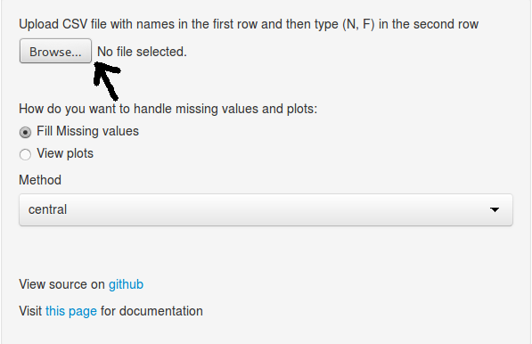
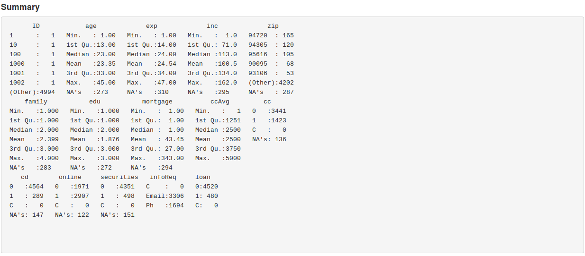
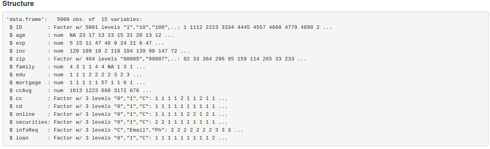
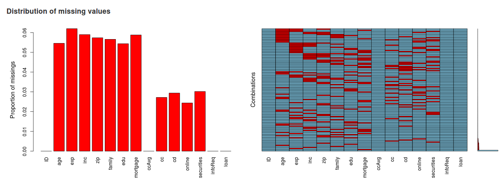
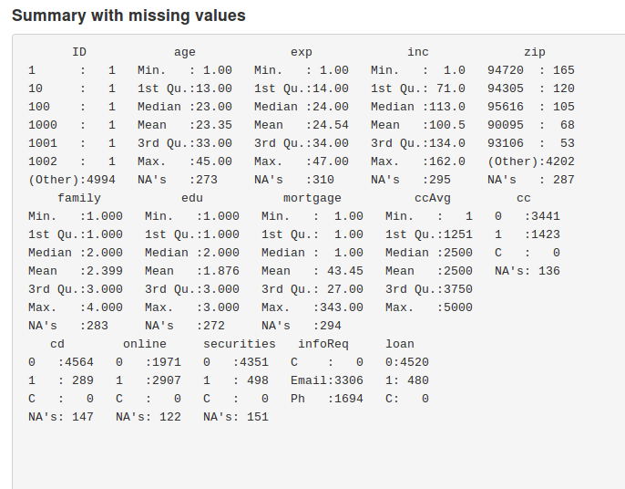
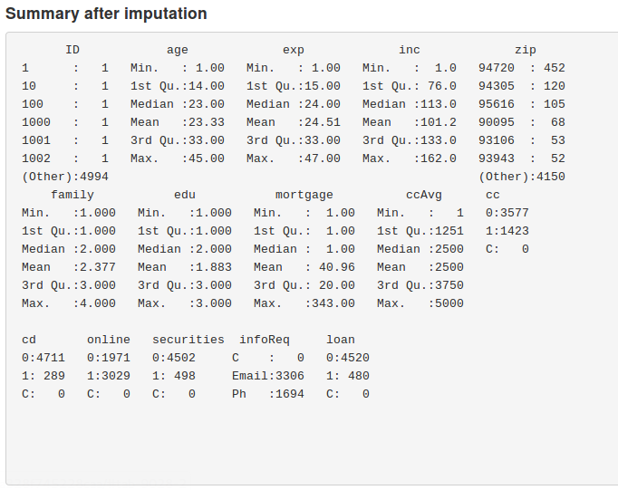
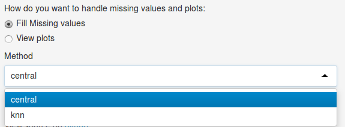
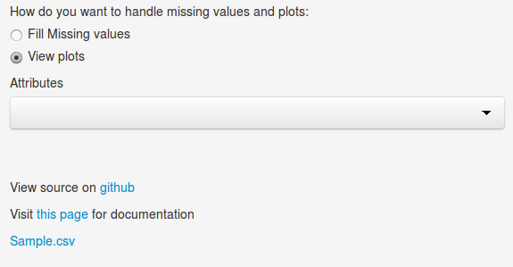

## Application Description

1. This app can be used for basic data exploratory analysis.  
2. One can easily analyse each variables of uplaoded data with simple Histogram.  
3. This app also facilitate missing imputation with following methods.  
    * Central Imputation (mean default)
    * Knn Imputation
        * Weighted Avg
        * Median  
        

---

## Uploading .csv file

1. click on browse button to uplaod .csv file

---

## Main Panel Summary Tab

1. This tab will two summary for uploaded dataset (Here I am taking <a href = "https://db.tt/NjtUG4GG" target = "_blank">sample.csv</a> for example)
    * summary

---

## Dataset Structure summary

- First figure shows summary for all the variables like mean, median, max value, min value etc.
- Second figure shows whether a variable is numeric, factor etc and all the classes for factor variable.

---

## Missing value Tab

1. This tab has three part   
    i. Distribution of missing values  
        This shows proportion of missing  value for each variable and distribution of missing value along each variable.
        
       

---

ii. This shows the summary of each variable before impuation process.

  

---

iii. This shows the summary of each variable after impuation process.

  

---

## Filling missing value

1. Select *Fill Missing Values* radio button option.
2. After selecting that option selection option from dropdown component for method of imputation.  
 
  

---

## Ploting variables

1. Select *View Plot* radio button option from side panel.
2. Attribute dropdown box will come. Select any of the variable from list and plot will be displayed in plot tab in main panel.
 
 

---

## Resources

1. This contains all the documentation for Data Pre-rocessing Widget.
2. Visit <a href = "https://dipak.shinyapps.io/Data_Products_Peer_Assessment/" target = "_blank"> this link</a> for this app.
3. Source code can be found on <a href = "https://github.com/Dipak22/DataProducts_Assessment" target = "_blank">github</a>.

--- 

## References 

1. https://shiny.rstudio.com/
2. https://shinyapps.io/
3. http://slidify.org/

